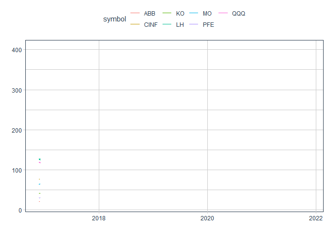

```r
#Function to create animated stock graph
stonk_calculator <- function(tickers) {
  stonks <- tq_get(tickers, get = "stock.prices", from = today() - years(5), to = today()) %>%
    ggplot(aes(x = date, y = close, color = symbol)) +
    geom_line() +
    transition_reveal(date) +
    labs(y = "", x = "") +
    theme_tq() +
    theme(legend.position = 'top')
  
  stonks
}
```


```r
#Create stock graph from given tickers
t <- c('QQQ','MO','KO','ABB','LH','PFE','CINF')

stonk_calculator(t)
```

<!-- -->

Recreated from Case Study 10
