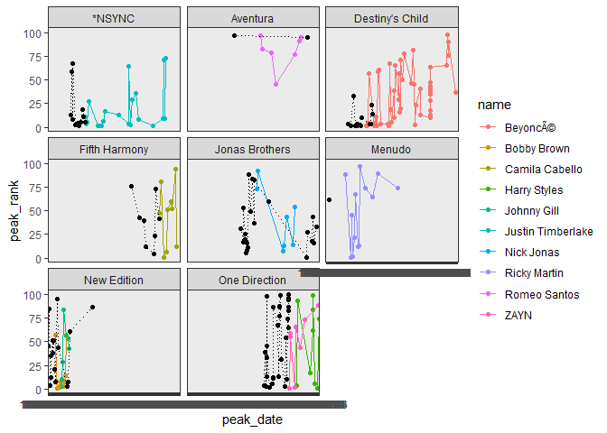

##### Load Packages

```r
library(tidyverse)
```

```
## -- Attaching packages --------------------------------------- tidyverse 1.3.0 --
```

```
## v ggplot2 3.3.3     v purrr   0.3.4
## v tibble  3.0.5     v dplyr   1.0.7
## v tidyr   1.1.2     v stringr 1.4.0
## v readr   1.4.0     v forcats 0.5.0
```

```
## Warning: package 'dplyr' was built under R version 4.0.5
```

```
## -- Conflicts ------------------------------------------ tidyverse_conflicts() --
## x dplyr::filter() masks stats::filter()
## x dplyr::lag()    masks stats::lag()
```

```r
library(dplyr)
library(downloader)
```

```
## Warning: package 'downloader' was built under R version 4.0.5
```

```r
library(readxl)
```
##### Load Data

```r
SoloData <- tibble(read.csv("solo-artist-followers.csv"))
head(SoloData)
```

```
## # A tibble: 6 x 5
##   name              band   followers band_followers follower_difference
##   <chr>             <chr>  <chr>     <chr>          <chr>              
## 1 Daron Jones       112    1.28k     783k           −782k            
## 2 Slim              112    2.14k     783k           −781k            
## 3 Q Parker          112    3.51k     783k           −780k            
## 4 JC Chasez         *NSYNC 30.8k     1.44M          −1.41M           
## 5 Joey Fatone       *NSYNC 1.13k     1.44M          −1.44M           
## 6 Justin Timberlake *NSYNC 10.3M     1.44M          8.90M
```

```r
BillboardData <- tibble(read.csv("billboard-hits.csv"))
str(BillboardData)
```

```
## tibble [456 x 5] (S3: tbl_df/tbl/data.frame)
##  $ name     : chr [1:456] "*NSYNC" "*NSYNC" "*NSYNC" "*NSYNC" ...
##  $ band     : chr [1:456] "" "" "" "" ...
##  $ title    : chr [1:456] "It's Gonna Be Me" "Music Of My Heart" "Bye Bye Bye" "This I Promise You" ...
##  $ peak_date: chr [1:456] "2000-07-28" "1999-10-15" "2000-04-14" "2000-12-01" ...
##  $ peak_rank: int [1:456] 1 2 4 5 5 8 11 13 19 59 ...
```

```r
#Change peak_date to date
BillboardData <- read_csv(
  ("billboard-hits.csv"),
  col_types = cols(
    peak_date = col_date()
  )
)
str(BillboardData)
```

```
## tibble [456 x 5] (S3: spec_tbl_df/tbl_df/tbl/data.frame)
##  $ name     : chr [1:456] "*NSYNC" "*NSYNC" "*NSYNC" "*NSYNC" ...
##  $ band     : chr [1:456] NA NA NA NA ...
##  $ title    : chr [1:456] "It's Gonna Be Me" "Music Of My Heart" "Bye Bye Bye" "This I Promise You" ...
##  $ peak_date: Date[1:456], format: "2000-07-28" "1999-10-15" ...
##  $ peak_rank: num [1:456] 1 2 4 5 5 8 11 13 19 59 ...
##  - attr(*, "spec")=
##   .. cols(
##   ..   name = col_character(),
##   ..   band = col_character(),
##   ..   title = col_character(),
##   ..   peak_date = col_date(format = ""),
##   ..   peak_rank = col_double()
##   .. )
```

All data types seem to be imported correctly, except the peak_date for billboard data.
Peak_date had to be converted to data type date.

#### Get hits data

```r
atleast_six_hits <- BillboardData %>%
  group_by(name) %>%
  filter(n() > 6 & band != "")

view(atleast_six_hits)
str(atleast_six_hits)
```

```
## tibble [144 x 5] (S3: grouped_df/tbl_df/tbl/data.frame)
##  $ name     : chr [1:144] "Justin Timberlake" "Justin Timberlake" "Justin Timberlake" "Justin Timberlake" ...
##  $ band     : chr [1:144] "*NSYNC" "*NSYNC" "*NSYNC" "*NSYNC" ...
##  $ title    : chr [1:144] "SexyBack" "My Love" "What Goes Around...Comes Around" "Can't Stop The Feeling!" ...
##  $ peak_date: Date[1:144], format: "2006-09-08" "2006-11-10" ...
##  $ peak_rank: num [1:144] 1 1 1 1 2 3 3 5 6 8 ...
##  - attr(*, "groups")= tibble [10 x 2] (S3: tbl_df/tbl/data.frame)
##   ..$ name : chr [1:10] "Beyoncé" "Bobby Brown" "Camila Cabello" "Harry Styles" ...
##   ..$ .rows: list<int> [1:10] 
##   .. ..$ : int [1:51] 30 31 32 33 34 35 36 37 38 39 ...
##   .. ..$ : int [1:11] 110 111 112 113 114 115 116 117 118 119 ...
##   .. ..$ : int [1:9] 81 82 83 84 85 86 87 88 89
##   .. ..$ : int [1:9] 128 129 130 131 132 133 134 135 136
##   .. ..$ : int [1:7] 121 122 123 124 125 126 127
##   .. ..$ : int [1:22] 1 2 3 4 5 6 7 8 9 10 ...
##   .. ..$ : int [1:7] 90 91 92 93 94 95 96
##   .. ..$ : int [1:13] 97 98 99 100 101 102 103 104 105 106 ...
##   .. ..$ : int [1:7] 23 24 25 26 27 28 29
##   .. ..$ : int [1:8] 137 138 139 140 141 142 143 144
##   .. ..@ ptype: int(0) 
##   ..- attr(*, ".drop")= logi TRUE
```


```r
band_hits <- BillboardData %>% 
  group_by(band) %>%
  filter(name %in% atleast_six_hits$band)
#Switch band and name column data
band_hits <- rename(band_hits, band = name, name = band)
view(band_hits)
```
#### Graph

```r
ggplot(data = atleast_six_hits, aes(x = peak_date, y = peak_rank, color = name, group = name)) +
  geom_point() +
  geom_line() +
  geom_point(data = band_hits, color = 'black') +
  geom_line(data = band_hits, color = 'black',linetype = 'dotted') +
  facet_wrap(~band, scales = "free") +
  theme_bw()
```

```
## geom_path: Each group consists of only one observation. Do you need to adjust
## the group aesthetic?
```

<!-- -->
It seems that majority of the top 100 hits for the bands are a result of having a good singer.
However, the Jonas Brothers, One Direction, and New Edition have had several top 100 hits regardless of the singer.
Beyonce seems to be the cause of majority of Destiny's Child top 100 hits.
