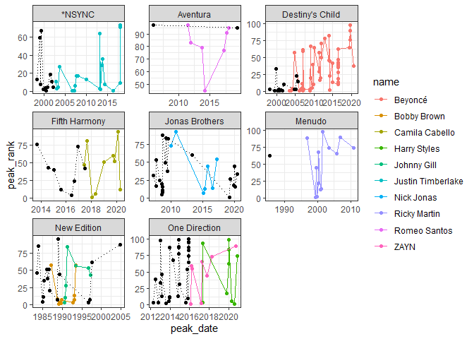

##### Load Data

```r
SoloData <- tibble(read_csv("solo-artist-followers.csv"))
```

```
## 
## -- Column specification --------------------------------------------------------
## cols(
##   name = col_character(),
##   band = col_character(),
##   followers = col_character(),
##   band_followers = col_character(),
##   follower_difference = col_character()
## )
```

```r
head(SoloData)
```

```
## # A tibble: 6 x 5
##   name              band   followers band_followers follower_difference
##   <chr>             <chr>  <chr>     <chr>          <chr>              
## 1 Daron Jones       112    1.28k     783k           -782k              
## 2 Slim              112    2.14k     783k           -781k              
## 3 Q Parker          112    3.51k     783k           -780k              
## 4 JC Chasez         *NSYNC 30.8k     1.44M          -1.41M             
## 5 Joey Fatone       *NSYNC 1.13k     1.44M          -1.44M             
## 6 Justin Timberlake *NSYNC 10.3M     1.44M          8.90M
```

```r
BillboardData <- tibble(read_csv("billboard-hits.csv"))
```

```
## 
## -- Column specification --------------------------------------------------------
## cols(
##   name = col_character(),
##   band = col_character(),
##   title = col_character(),
##   peak_date = col_date(format = ""),
##   peak_rank = col_double()
## )
```

```r
str(BillboardData)
```

```
## tibble [456 x 5] (S3: tbl_df/tbl/data.frame)
##  $ name     : chr [1:456] "*NSYNC" "*NSYNC" "*NSYNC" "*NSYNC" ...
##  $ band     : chr [1:456] NA NA NA NA ...
##  $ title    : chr [1:456] "It's Gonna Be Me" "Music Of My Heart" "Bye Bye Bye" "This I Promise You" ...
##  $ peak_date: Date[1:456], format: "2000-07-28" "1999-10-15" ...
##  $ peak_rank: num [1:456] 1 2 4 5 5 8 11 13 19 59 ...
##  - attr(*, "spec")=
##   .. cols(
##   ..   name = col_character(),
##   ..   band = col_character(),
##   ..   title = col_character(),
##   ..   peak_date = col_date(format = ""),
##   ..   peak_rank = col_double()
##   .. )
```

```r
#Change peak_date to date
BillboardData <- read_csv(
  ("billboard-hits.csv"),
  col_types = cols(
    peak_date = col_date()
  )
)
str(BillboardData)
```

```
## tibble [456 x 5] (S3: spec_tbl_df/tbl_df/tbl/data.frame)
##  $ name     : chr [1:456] "*NSYNC" "*NSYNC" "*NSYNC" "*NSYNC" ...
##  $ band     : chr [1:456] NA NA NA NA ...
##  $ title    : chr [1:456] "It's Gonna Be Me" "Music Of My Heart" "Bye Bye Bye" "This I Promise You" ...
##  $ peak_date: Date[1:456], format: "2000-07-28" "1999-10-15" ...
##  $ peak_rank: num [1:456] 1 2 4 5 5 8 11 13 19 59 ...
##  - attr(*, "spec")=
##   .. cols(
##   ..   name = col_character(),
##   ..   band = col_character(),
##   ..   title = col_character(),
##   ..   peak_date = col_date(format = ""),
##   ..   peak_rank = col_double()
##   .. )
```

All data types seem to be imported correctly, except the peak_date for billboard data.
Peak_date had to be converted to data type date.

#### Get hits data

```r
atleast_six_hits <- BillboardData %>%
  group_by(name) %>%
  filter(n() > 6 & band != "")

view(atleast_six_hits)
str(atleast_six_hits)
```

```
## tibble [144 x 5] (S3: grouped_df/tbl_df/tbl/data.frame)
##  $ name     : chr [1:144] "Justin Timberlake" "Justin Timberlake" "Justin Timberlake" "Justin Timberlake" ...
##  $ band     : chr [1:144] "*NSYNC" "*NSYNC" "*NSYNC" "*NSYNC" ...
##  $ title    : chr [1:144] "SexyBack" "My Love" "What Goes Around...Comes Around" "Can't Stop The Feeling!" ...
##  $ peak_date: Date[1:144], format: "2006-09-08" "2006-11-10" ...
##  $ peak_rank: num [1:144] 1 1 1 1 2 3 3 5 6 8 ...
##  - attr(*, "groups")= tibble [10 x 2] (S3: tbl_df/tbl/data.frame)
##   ..$ name : chr [1:10] "Beyoncé" "Bobby Brown" "Camila Cabello" "Harry Styles" ...
##   ..$ .rows: list<int> [1:10] 
##   .. ..$ : int [1:51] 30 31 32 33 34 35 36 37 38 39 ...
##   .. ..$ : int [1:11] 110 111 112 113 114 115 116 117 118 119 ...
##   .. ..$ : int [1:9] 81 82 83 84 85 86 87 88 89
##   .. ..$ : int [1:9] 128 129 130 131 132 133 134 135 136
##   .. ..$ : int [1:7] 121 122 123 124 125 126 127
##   .. ..$ : int [1:22] 1 2 3 4 5 6 7 8 9 10 ...
##   .. ..$ : int [1:7] 90 91 92 93 94 95 96
##   .. ..$ : int [1:13] 97 98 99 100 101 102 103 104 105 106 ...
##   .. ..$ : int [1:7] 23 24 25 26 27 28 29
##   .. ..$ : int [1:8] 137 138 139 140 141 142 143 144
##   .. ..@ ptype: int(0) 
##   ..- attr(*, ".drop")= logi TRUE
```


```r
band_hits <- BillboardData %>% 
  group_by(band) %>%
  filter(name %in% atleast_six_hits$band)
#Switch band and name column data
band_hits <- rename(band_hits, band = name, name = band)
head(band_hits)
```

```
## # A tibble: 6 x 5
## # Groups:   name [1]
##   band   name  title                     peak_date  peak_rank
##   <chr>  <chr> <chr>                     <date>         <dbl>
## 1 *NSYNC <NA>  It's Gonna Be Me          2000-07-28         1
## 2 *NSYNC <NA>  Music Of My Heart         1999-10-15         2
## 3 *NSYNC <NA>  Bye Bye Bye               2000-04-14         4
## 4 *NSYNC <NA>  This I Promise You        2000-12-01         5
## 5 *NSYNC <NA>  Girlfriend                2002-04-05         5
## 6 *NSYNC <NA>  A Little More Time On You 1999-02-26         8
```
#### Graph

```r
ggplot(data = atleast_six_hits, aes(x = peak_date, y = peak_rank, color = name, group = name)) +
  geom_point() +
  geom_line() +
  geom_point(data = band_hits, color = 'black') +
  geom_line(data = band_hits, color = 'black',linetype = 'dotted') +
  facet_wrap(~band, scales = "free") +
  theme_bw()
```

```
## geom_path: Each group consists of only one observation. Do you need to adjust
## the group aesthetic?
```

<!-- -->
It seems that majority of the top 100 hits for the bands are a result of having a good singer.
However, the Jonas Brothers, One Direction, and New Edition have had several top 100 hits regardless of the singer.
Beyonce seems to be the cause of majority of Destiny's Child top 100 hits.

### Additional data

```r
microsftData <- tibble(read.csv("MSFT.csv"))
#Change data to data type date
microsftData <- read_csv(
  ("MSFT.csv"),
  col_types = cols(
    Time = col_date()
  )
)
```

```
## Warning: The following named parsers don't match the column names: Time
```

```r
str(microsftData)
```

```
## tibble [253 x 7] (S3: spec_tbl_df/tbl_df/tbl/data.frame)
##  $ Date     : Date[1:253], format: "2020-09-14" "2020-09-15" ...
##  $ Open     : num [1:253] 204 208 211 200 203 ...
##  $ High     : num [1:253] 209 210 211 204 204 ...
##  $ Low      : num [1:253] 204 207 205 200 196 ...
##  $ Close    : num [1:253] 205 209 205 203 200 ...
##  $ Adj Close: num [1:253] 204 207 203 201 199 ...
##  $ Volume   : num [1:253] 30375800 21823900 26328100 34011300 55225300 ...
##  - attr(*, "spec")=
##   .. cols(
##   ..   Date = col_date(format = ""),
##   ..   Open = col_double(),
##   ..   High = col_double(),
##   ..   Low = col_double(),
##   ..   Close = col_double(),
##   ..   `Adj Close` = col_double(),
##   ..   Volume = col_double()
##   .. )
```
https://finance.yahoo.com/quote/MSFT/history?p=MSFT
Microsoft data for 1 year for daily candles

```r
june_2021_employment_Data <- tibble(read_csv("business-employment-data-june-2021-quarter.csv"))
```

```
## 
## -- Column specification --------------------------------------------------------
## cols(
##   Series_reference = col_character(),
##   Period = col_double(),
##   Data_value = col_double(),
##   Suppressed = col_character(),
##   STATUS = col_character(),
##   UNITS = col_character(),
##   Magnitude = col_double(),
##   Subject = col_character(),
##   Group = col_character(),
##   Series_title_1 = col_character(),
##   Series_title_2 = col_character(),
##   Series_title_3 = col_character(),
##   Series_title_4 = col_logical(),
##   Series_title_5 = col_logical()
## )
```

```r
str(june_2021_employment_Data)
```

```
## tibble [18,706 x 14] (S3: tbl_df/tbl/data.frame)
##  $ Series_reference: chr [1:18706] "BDCQ.SEA1AA" "BDCQ.SEA1AA" "BDCQ.SEA1AA" "BDCQ.SEA1AA" ...
##  $ Period          : num [1:18706] 2011 2011 2011 2012 2012 ...
##  $ Data_value      : num [1:18706] 80078 78324 85850 90743 81780 ...
##  $ Suppressed      : chr [1:18706] NA NA NA NA ...
##  $ STATUS          : chr [1:18706] "F" "F" "F" "F" ...
##  $ UNITS           : chr [1:18706] "Number" "Number" "Number" "Number" ...
##  $ Magnitude       : num [1:18706] 0 0 0 0 0 0 0 0 0 0 ...
##  $ Subject         : chr [1:18706] "Business Data Collection - BDC" "Business Data Collection - BDC" "Business Data Collection - BDC" "Business Data Collection - BDC" ...
##  $ Group           : chr [1:18706] "Industry by employment variable" "Industry by employment variable" "Industry by employment variable" "Industry by employment variable" ...
##  $ Series_title_1  : chr [1:18706] "Filled jobs" "Filled jobs" "Filled jobs" "Filled jobs" ...
##  $ Series_title_2  : chr [1:18706] "Agriculture, Forestry and Fishing" "Agriculture, Forestry and Fishing" "Agriculture, Forestry and Fishing" "Agriculture, Forestry and Fishing" ...
##  $ Series_title_3  : chr [1:18706] "Actual" "Actual" "Actual" "Actual" ...
##  $ Series_title_4  : logi [1:18706] NA NA NA NA NA NA ...
##  $ Series_title_5  : logi [1:18706] NA NA NA NA NA NA ...
##  - attr(*, "spec")=
##   .. cols(
##   ..   Series_reference = col_character(),
##   ..   Period = col_double(),
##   ..   Data_value = col_double(),
##   ..   Suppressed = col_character(),
##   ..   STATUS = col_character(),
##   ..   UNITS = col_character(),
##   ..   Magnitude = col_double(),
##   ..   Subject = col_character(),
##   ..   Group = col_character(),
##   ..   Series_title_1 = col_character(),
##   ..   Series_title_2 = col_character(),
##   ..   Series_title_3 = col_character(),
##   ..   Series_title_4 = col_logical(),
##   ..   Series_title_5 = col_logical()
##   .. )
```
https://www.stats.govt.nz/large-datasets/csv-files-for-download/
Employment Data for quarter in June 2021

```r
cattle_priceData <- tibble(read_csv("cattle-futures.csv"))
```

```
## 
## -- Column specification --------------------------------------------------------
## cols(
##   date = col_character(),
##   value = col_double()
## )
```

```r
#Change data to data type date
cattle_priceData <- read_csv(
  ("cattle-futures.csv"),
  col_types = cols(
    date = col_date("%m/%d/%Y")
  )
)
str(cattle_priceData)
```

```
## tibble [14,292 x 2] (S3: spec_tbl_df/tbl_df/tbl/data.frame)
##  $ date : Date[1:14292], format: "1964-11-30" "1964-12-01" ...
##  $ value: num [1:14292] 23.7 23.5 23.4 23.4 23.4 ...
##  - attr(*, "spec")=
##   .. cols(
##   ..   date = col_date(format = "%m/%d/%Y"),
##   ..   value = col_double()
##   .. )
```
https://www.macrotrends.net/futures/cattle
Cattle Futures prices by year from 1964 to 2021
