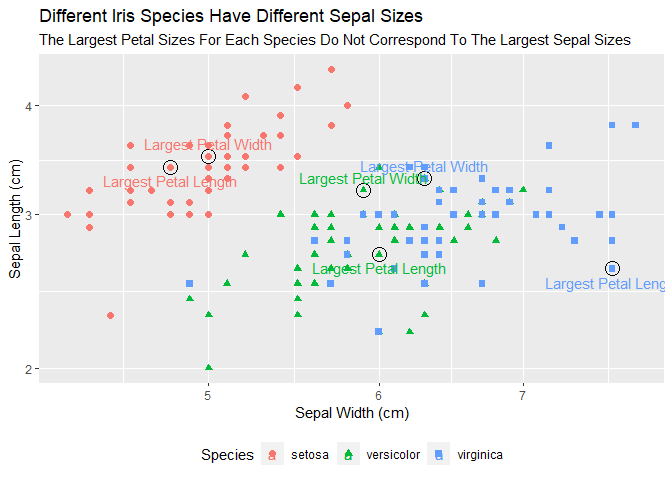
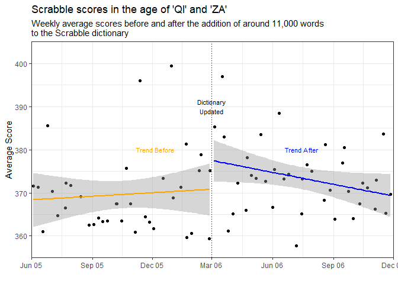

##### Load Data

```r
head(iris)
```

```
##   Sepal.Length Sepal.Width Petal.Length Petal.Width Species
## 1          5.1         3.5          1.4         0.2  setosa
## 2          4.9         3.0          1.4         0.2  setosa
## 3          4.7         3.2          1.3         0.2  setosa
## 4          4.6         3.1          1.5         0.2  setosa
## 5          5.0         3.6          1.4         0.2  setosa
## 6          5.4         3.9          1.7         0.4  setosa
```

### Iris data

```r
largest_petal_width <- iris %>%
  group_by(Species) %>%
  filter(row_number(desc(Petal.Width)) == 1)
largest_petal_width
```

```
## # A tibble: 3 x 5
## # Groups:   Species [3]
##   Sepal.Length Sepal.Width Petal.Length Petal.Width Species   
##          <dbl>       <dbl>        <dbl>       <dbl> <fct>     
## 1          5           3.5          1.6         0.6 setosa    
## 2          5.9         3.2          4.8         1.8 versicolor
## 3          6.3         3.3          6           2.5 virginica
```

```r
largest_petal_length <- iris %>%
  group_by(Species) %>%
  filter(row_number(desc(Petal.Length)) == 1)
largest_petal_length
```

```
## # A tibble: 3 x 5
## # Groups:   Species [3]
##   Sepal.Length Sepal.Width Petal.Length Petal.Width Species   
##          <dbl>       <dbl>        <dbl>       <dbl> <fct>     
## 1          4.8         3.4          1.9         0.2 setosa    
## 2          6           2.7          5.1         1.6 versicolor
## 3          7.7         2.6          6.9         2.3 virginica
```

### Iris graph

```r
ggplot(data = iris, mapping = aes(x = Sepal.Length, y = Sepal.Width, color = Species,
                                  shape = Species)) +
  geom_point(size = 2) +
  geom_point(size = 5, shape = 1, color = 'black', data = largest_petal_width) +
  geom_text(aes(color = Species, label = "Largest Petal Width"), data = largest_petal_width, nudge_y = .015) +
  geom_point(size = 5, shape = 1, color = 'black', data = largest_petal_length) +
  geom_text(aes(color = Species, label = "Largest Petal Length"), data = largest_petal_length, nudge_y = -.015) +
  scale_x_log10() +
  scale_y_log10() +
  labs(x = "Sepal Width (cm)",
       y = "Sepal Length (cm)",
       title = "Different Iris Species Have Different Sepal Sizes",
       subtitle = "The Largest Petal Sizes For Each Species Do Not Correspond To The Largest Sepal Sizes") +
  theme(legend.position = 'bottom')
```

<!-- -->
### Load Scrabble Data

```r
ScrabbleData <- tempfile()
download("https://github.com/fivethirtyeight/data/raw/master/scrabble-games/scrabble_games.csv", ScrabbleData, mode = "wb")
Scrabble <- read_csv(ScrabbleData)
```

```
## 
## -- Column specification --------------------------------------------------------
## cols(
##   gameid = col_double(),
##   tourneyid = col_double(),
##   tie = col_logical(),
##   winnerid = col_double(),
##   winnername = col_character(),
##   winnerscore = col_double(),
##   winneroldrating = col_double(),
##   winnernewrating = col_double(),
##   winnerpos = col_double(),
##   loserid = col_double(),
##   losername = col_character(),
##   loserscore = col_double(),
##   loseroldrating = col_double(),
##   losernewrating = col_double(),
##   loserpos = col_double(),
##   round = col_double(),
##   division = col_double(),
##   date = col_date(format = ""),
##   lexicon = col_logical()
## )
```

```r
str(Scrabble)
```

```
## tibble [1,542,642 x 19] (S3: spec_tbl_df/tbl_df/tbl/data.frame)
##  $ gameid         : num [1:1542642] 1 2 3 4 5 6 7 8 9 10 ...
##  $ tourneyid      : num [1:1542642] 1 1 1 1 1 1 1 1 1 1 ...
##  $ tie            : logi [1:1542642] FALSE FALSE FALSE FALSE FALSE FALSE ...
##  $ winnerid       : num [1:1542642] 268 268 268 268 268 268 268 268 429 429 ...
##  $ winnername     : chr [1:1542642] "Harriette Lakernick" "Harriette Lakernick" "Harriette Lakernick" "Harriette Lakernick" ...
##  $ winnerscore    : num [1:1542642] 0 0 0 0 0 0 0 0 0 0 ...
##  $ winneroldrating: num [1:1542642] 1568 1568 1568 1568 1568 ...
##  $ winnernewrating: num [1:1542642] 1684 1684 1684 1684 1684 ...
##  $ winnerpos      : num [1:1542642] 1 1 1 1 1 1 1 1 3 3 ...
##  $ loserid        : num [1:1542642] 429 435 441 456 1334 ...
##  $ losername      : chr [1:1542642] "Patricia Barrett" "Chris Cree" "Caesar Jaramillo" "Mike Chitwood" ...
##  $ loserscore     : num [1:1542642] 0 0 0 0 0 0 0 0 0 0 ...
##  $ loseroldrating : num [1:1542642] 1915 1840 1622 1612 1537 ...
##  $ losernewrating : num [1:1542642] 1872 1798 1606 1600 1590 ...
##  $ loserpos       : num [1:1542642] 3 6 10 9 4 8 7 2 9 4 ...
##  $ round          : num [1:1542642] 1 2 3 4 6 8 9 10 3 5 ...
##  $ division       : num [1:1542642] 1 1 1 1 1 1 1 1 1 1 ...
##  $ date           : Date[1:1542642], format: "1998-12-06" "1998-12-06" ...
##  $ lexicon        : logi [1:1542642] FALSE FALSE FALSE FALSE FALSE FALSE ...
##  - attr(*, "spec")=
##   .. cols(
##   ..   gameid = col_double(),
##   ..   tourneyid = col_double(),
##   ..   tie = col_logical(),
##   ..   winnerid = col_double(),
##   ..   winnername = col_character(),
##   ..   winnerscore = col_double(),
##   ..   winneroldrating = col_double(),
##   ..   winnernewrating = col_double(),
##   ..   winnerpos = col_double(),
##   ..   loserid = col_double(),
##   ..   losername = col_character(),
##   ..   loserscore = col_double(),
##   ..   loseroldrating = col_double(),
##   ..   losernewrating = col_double(),
##   ..   loserpos = col_double(),
##   ..   round = col_double(),
##   ..   division = col_double(),
##   ..   date = col_date(format = ""),
##   ..   lexicon = col_logical()
##   .. )
```


```r
ScrabbleAll <- Scrabble %>%
  select(date, winnerscore, loserscore) %>%
  pivot_longer(c("winnerscore","loserscore"), names_to = "win-loss", values_to = "score") %>%
  filter(score > 0) %>%
  mutate(year = year(date),
         week = week(date)
  )
head(ScrabbleAll)
```

```
## # A tibble: 6 x 5
##   date       `win-loss`  score  year  week
##   <date>     <chr>       <dbl> <dbl> <dbl>
## 1 1999-01-15 winnerscore   521  1999     3
## 2 1999-01-15 loserscore    237  1999     3
## 3 1999-01-15 winnerscore   488  1999     3
## 4 1999-01-15 loserscore    262  1999     3
## 5 1999-01-15 winnerscore   465  1999     3
## 6 1999-01-15 loserscore    330  1999     3
```


```r
weekly_average <- ScrabbleAll %>%
  group_by(year, week) %>%
  summarise(average_score = mean(score), Date = min(date))
```

```
## `summarise()` has grouped output by 'year'. You can override using the `.groups` argument.
```

```r
head(weekly_average)
```

```
## # A tibble: 6 x 4
## # Groups:   year [2]
##    year  week average_score Date      
##   <dbl> <dbl>         <dbl> <date>    
## 1  1976    49          367. 1976-12-05
## 2  1977     5          324  1977-02-01
## 3  1977     9          317. 1977-02-27
## 4  1977    10          414. 1977-03-05
## 5  1977    13          371. 1977-03-26
## 6  1977    19          354. 1977-05-07
```

```r
after <- ScrabbleAll %>%
  group_by(year, week) %>%
  filter(date > as.Date("2006-03-01")) %>%
  summarise(average_score = mean(score), Date = min(date))
```

```
## `summarise()` has grouped output by 'year'. You can override using the `.groups` argument.
```

```r
before <- ScrabbleAll %>%
  group_by(year, week) %>%
  filter(date <= as.Date("2006-03-01")) %>%
  summarise(average_score = mean(score), Date = min(date))
```

```
## `summarise()` has grouped output by 'year'. You can override using the `.groups` argument.
```

```r
ggplot(data = weekly_average, mapping = aes(x = Date, y = average_score)) +
  geom_point() +
  geom_smooth(data = before, method = "lm", color = "orange") +
  annotate("text", x = as.Date('2005-12-05'), y = 380, label = 'Trend Before', color = "orange", size = 3) +
  geom_smooth(data = after, method = "lm", color = "blue") +
  annotate("text", as.Date('2006-07-15'), y = 380, label = 'Trend After', color = "blue", size = 3) +
  geom_vline(xintercept = as.Date('2006-03-01'), linetype = "dotted") +
  annotate("text", x = as.Date('2006-03-01'), y = 390, label = 'Dictionary\nUpdated', size = 3) +
  labs(y = 'Average Score', x = "", title = "Scrabble scores in the age of 'QI' and 'ZA'", subtitle = 'Weekly average scores before and after the addition of around 11,000 words\nto the Scrabble dictionary') +
  coord_cartesian(ylim = c(355,405), expand = FALSE) +
  scale_x_date(date_breaks = "3 month", 
           limits = as.Date(c('1/6/2005', '1/12/2006'), format = "%d/%m/%Y"),
           date_labels = "%b %y" ) +
  theme_bw()
```

```
## `geom_smooth()` using formula 'y ~ x'
```

```
## Warning: Removed 542 rows containing non-finite values (stat_smooth).
```

```
## `geom_smooth()` using formula 'y ~ x'
```

```
## Warning: Removed 537 rows containing non-finite values (stat_smooth).
```

```
## Warning: Removed 1079 rows containing missing values (geom_point).
```

<!-- -->


