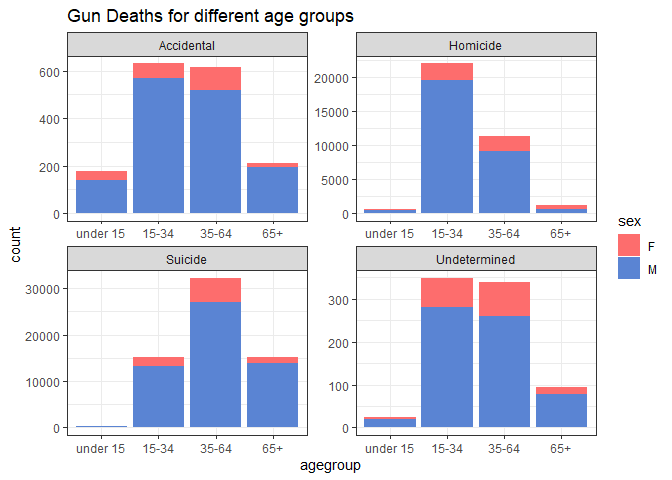
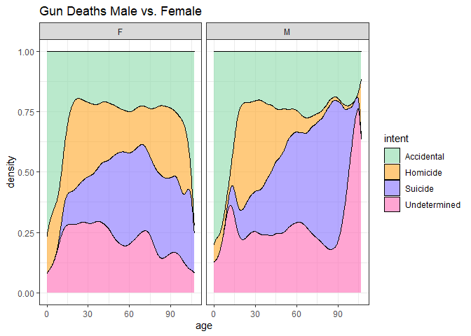
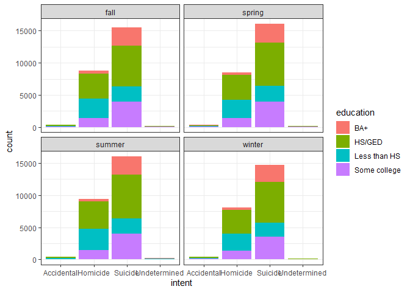

### Load Data

```r
GunData <- tempfile()
download("https://raw.githubusercontent.com/fivethirtyeight/guns-data/master/full_data.csv", GunData, mode = "wb")
gunData <- read_csv(GunData)
```

```
## Warning: Missing column names filled in: 'X1' [1]
```

```
## 
## -- Column specification --------------------------------------------------------
## cols(
##   X1 = col_double(),
##   year = col_double(),
##   month = col_character(),
##   intent = col_character(),
##   police = col_double(),
##   sex = col_character(),
##   age = col_double(),
##   race = col_character(),
##   hispanic = col_double(),
##   place = col_character(),
##   education = col_character()
## )
```

```r
gunData_new <- gunData %>%
  filter(age != "", intent != "")
str(gunData)
```

```
## tibble [100,798 x 11] (S3: spec_tbl_df/tbl_df/tbl/data.frame)
##  $ X1       : num [1:100798] 1 2 3 4 5 6 7 8 9 10 ...
##  $ year     : num [1:100798] 2012 2012 2012 2012 2012 ...
##  $ month    : chr [1:100798] "01" "01" "01" "02" ...
##  $ intent   : chr [1:100798] "Suicide" "Suicide" "Suicide" "Suicide" ...
##  $ police   : num [1:100798] 0 0 0 0 0 0 0 0 0 0 ...
##  $ sex      : chr [1:100798] "M" "F" "M" "M" ...
##  $ age      : num [1:100798] 34 21 60 64 31 17 48 41 50 NA ...
##  $ race     : chr [1:100798] "Asian/Pacific Islander" "White" "White" "White" ...
##  $ hispanic : num [1:100798] 100 100 100 100 100 100 100 100 100 998 ...
##  $ place    : chr [1:100798] "Home" "Street" "Other specified" "Home" ...
##  $ education: chr [1:100798] "BA+" "Some college" "BA+" "BA+" ...
##  - attr(*, "spec")=
##   .. cols(
##   ..   X1 = col_double(),
##   ..   year = col_double(),
##   ..   month = col_character(),
##   ..   intent = col_character(),
##   ..   police = col_double(),
##   ..   sex = col_character(),
##   ..   age = col_double(),
##   ..   race = col_character(),
##   ..   hispanic = col_double(),
##   ..   place = col_character(),
##   ..   education = col_character()
##   .. )
```


```r
gunsData <- gunData_new %>%
  mutate(agegroup =
          case_when(
            age >= 0 & age <= 14 ~ "under 15",
            age >= 15 & age <= 34 ~ "15-34",
            age >= 35 & age <= 64 ~ "35-64",
            age >= 65 ~ "65+"),
         agegroup = fct_relevel(agegroup, 
            "under 15", "15-34", "35-64", 
            "65+"))

ggplot(data = gunsData, aes(x = agegroup, fill = sex)) +
  geom_bar() +
  facet_wrap(~intent, nrow = 2, scales = 'free') +
  scale_fill_manual(values = c('#FD6D6D', '#5A84D3')) +
  ggtitle("Gun Deaths for different age groups") +
  theme_bw()
```

<!-- -->


```r
ggplot(data = gunData_new, aes(x = age, fill = intent)) +
  geom_density(position = 'fill') +
  facet_wrap(~sex) +
  scale_fill_manual(values = c("#8CDBAA","#FFA727","lightslateblue","hotpink")) +
  ggtitle("Gun Deaths Male vs. Female") +
  theme_bw()
```

<!-- -->


```r
gunData_new$month <- as.integer(gunData_new$month)
season <- gunData_new %>%
  filter(education != "") %>%
  mutate(seasons =
          case_when(
            month >= 3 & month <= 5 ~ "spring",
            month >= 6 & month <= 8 ~ "summer",
            month >= 9 & month <= 11 ~ "fall",
            month == 12 | month <= 2 ~ "winter"))
```


```r
#Graph 1
ggplot(season, aes(intent, fill = education)) +
  geom_bar() +
  facet_wrap(~seasons, scales = "free") +
  theme_bw()
```

<!-- -->
A vast majority of all gun deaths are because of suicide. Most gun deaths are also by people that have a high school degree or a GED. Homicides for people with less than a high school education seem to increase in the summer and decrease in the winter. People with less than than high school education should be targeted more in the summer than the winter.


```r
#Graph 2
ggplot(season, aes(seasons, fill = race)) +
  geom_bar() +
  facet_wrap(~race, scales = 'free') +
  theme_bw() +
  theme(legend.position = 'none')
```

<!-- -->
The graphs show that gun deaths for Asians/Pacific Islanders increase in the fall and the summer and decrease in the spring and winter. For majority of the races, there seems to be a spike in gun deaths in the summer.
