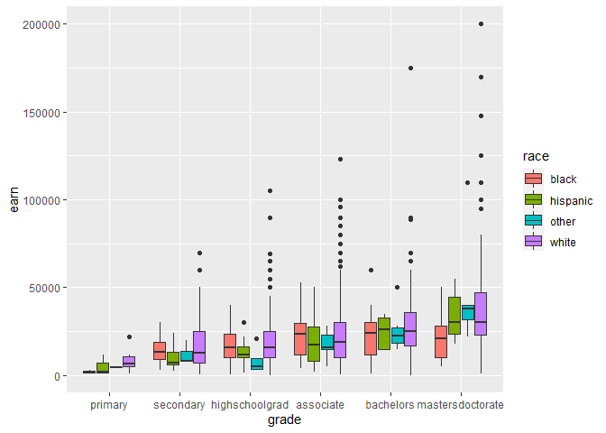
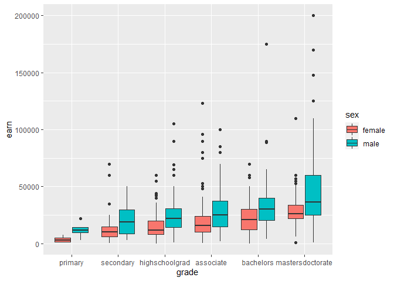
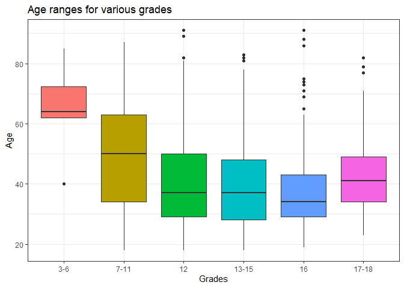

### Load Data

```r
HeightData <- tempfile()
download("https://raw.githubusercontent.com/hadley/r4ds/master/data/heights.csv", HeightData, mode = "wb")
Height <- read_csv(HeightData)
```

```
## 
## -- Column specification --------------------------------------------------------
## cols(
##   earn = col_double(),
##   height = col_double(),
##   sex = col_character(),
##   ed = col_double(),
##   age = col_double(),
##   race = col_character()
## )
```

```r
head(Height)
```

```
## # A tibble: 6 x 6
##    earn height sex       ed   age race 
##   <dbl>  <dbl> <chr>  <dbl> <dbl> <chr>
## 1 50000   74.4 male      16    45 white
## 2 60000   65.5 female    16    58 white
## 3 30000   63.6 female    16    29 white
## 4 50000   63.1 female    16    91 other
## 5 51000   63.4 female    17    39 white
## 6  9000   64.4 female    15    26 white
```
### Add new column to specify grade

```r
HeightEd <- Height %>%
  mutate(grade =
          case_when(
            ed >= 3 & ed <= 6 ~ "primary", 
            ed >= 7 & ed <= 11 ~ "secondary",
            ed == 12 ~ "highschoolgrad",
            ed >= 13 & ed <= 15 ~ "associate",
            ed == 16 ~ "bachelors",
            ed == 17 | ed == 18 ~ "mastersdoctorate"))
```
### Relationship between education and race

```r
HeightEd %>%
  mutate(grade = as.factor(fct_reorder(grade, earn))) %>%
  ggplot(aes(x = grade, y = earn, fill = race)) +
    geom_boxplot()
```

<!-- -->
### Relationship between education and sex

```r
HeightEd %>%
  mutate(grade = as.factor(fct_reorder(grade, earn))) %>%
  ggplot(aes(x = grade, y = earn, fill = sex)) +
    geom_boxplot()
```

<!-- -->


```r
HeightEd %>%
  mutate(grade = fct_relevel(grade, 
            "primary", "secondary", "highschoolgrad", 
            "associate", "bachelors", "mastersdoctorate"), 
         grade = fct_collapse(grade,
                                "3-6" = "primary",
                                "7-11" = "secondary",
                                "12" = "highschoolgrad",
                                "13-15" = "associate",
                                "16" = "bachelors",
                                "17-18" = "mastersdoctorate")) %>%
  ggplot(aes(x = grade, y = age, fill = grade)) +
    geom_boxplot() +
    labs(x = "Grades", y = "Age", title = "Age ranges for various grades") +
    theme_bw() +
    theme(legend.position = "none")
```

<!-- -->
The graph shows that age seems to be decreasing until grade 16.However, the ages seem high compared to the grades. The graph also shows there is a big range for the middle grades but the outsides have smaller ranges.

