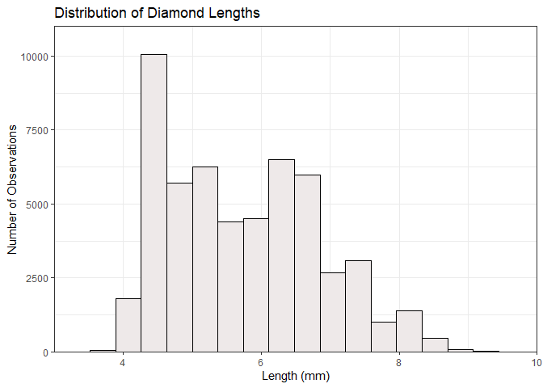
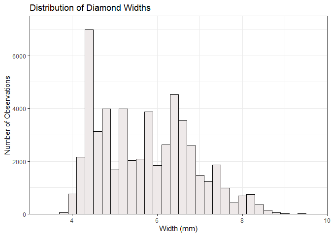
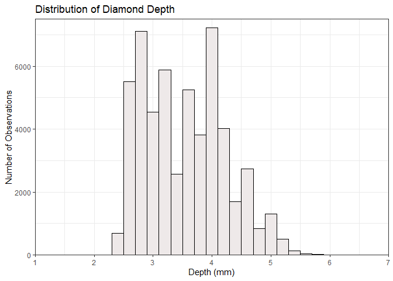
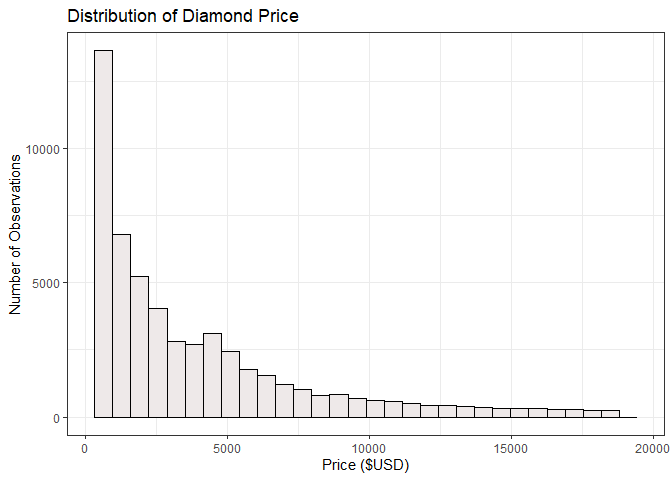
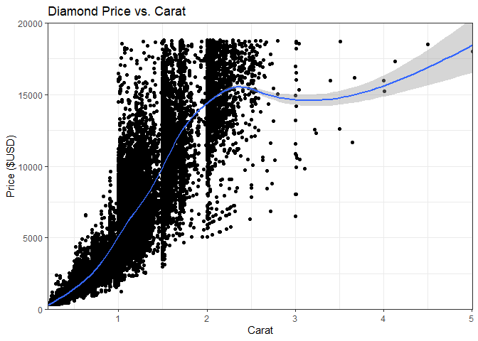
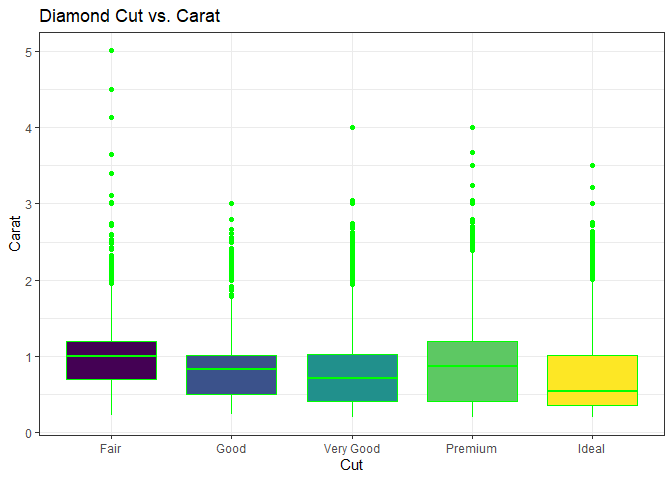
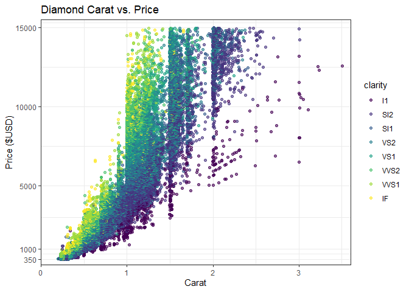
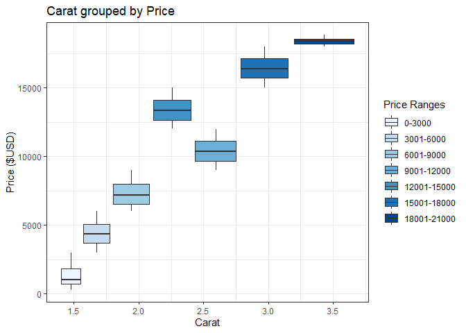
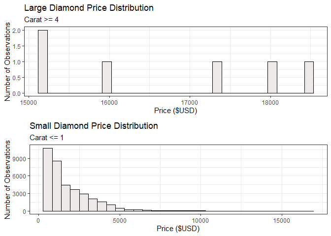
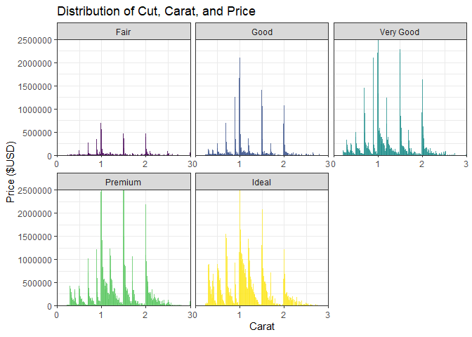

```r
ggplot(diamonds, aes(x)) +
  geom_histogram(color = 'black', fill = 'snow2') +
  labs(x = 'Length (mm)', y = 'Number of Observations', title = 'Distribution of Diamond Lengths') +
  coord_cartesian(xlim = c(3,10),ylim = c(0, 11000), expand = FALSE) +
  theme_bw()
```

```
## `stat_bin()` using `bins = 30`. Pick better value with `binwidth`.
```

<!-- -->


```r
ggplot(diamonds, aes(y)) +
  geom_histogram(color = 'black', fill = 'snow2', binwidth = .20) +
  labs(x = 'Width (mm)', y = 'Number of Observations', title = 'Distribution of Diamond Widths') +
  coord_cartesian(xlim = c(3,10), ylim = c(0, 7500), expand = FALSE) +
  theme_bw()
```

<!-- -->


```r
ggplot(diamonds, aes(z)) +
  geom_histogram(color = 'black', fill = 'snow2', binwidth = .20) +
  labs(x = 'Depth (mm)', y = 'Number of Observations', title = 'Distribution of Diamond Depth') +
  coord_cartesian(xlim = c(1,7), ylim = c(0, 7500), expand = FALSE) +
  theme_bw()
```

<!-- -->


```r
ggplot(diamonds, aes(price)) +
  geom_histogram(color = 'black', fill = 'snow2') +
  labs(x = 'Price ($USD)', y = 'Number of Observations', title = 'Distribution of Diamond Price') +
  theme_bw()
```

```
## `stat_bin()` using `bins = 30`. Pick better value with `binwidth`.
```

<!-- -->

The distribution of price of diamonds is right skewed. The majority of the price of diamonds seems to be on the cheaper side between $0 and $5000.


```r
ggplot(diamonds, aes(carat, price)) +
  geom_point() +
  geom_smooth() +
  labs(x = 'Carat', y = 'Price ($USD)', title = 'Diamond Price vs. Carat') +
  coord_cartesian(ylim = c(0, 20000), expand = FALSE) +
  theme_bw()
```

```
## `geom_smooth()` using method = 'gam' and formula 'y ~ s(x, bs = "cs")'
```

<!-- -->


```r
ggplot(diamonds, aes(cut, carat)) +
  geom_boxplot(aes(fill = cut), color = 'green') +
  labs(x = 'Cut', y = 'Carat', title = 'Diamond Cut vs. Carat') +
  theme_bw() +
  theme(legend.position = 'none')
```

<!-- -->
The Cut seems to have a slight negative correlation with Carat. As the Cut gets better the Carat seems slightly decrease.


```r
ggplot(data = diamonds, aes(x = carat, y = price)) + 
  geom_point(aes(color = clarity), alpha = 0.6, position = 'jitter') +
  scale_y_continuous(limits = c(350, 15000),
    breaks = c(350, 1000, 5000, 10000, 15000)) +
  coord_cartesian(xlim = c(0, 3.6), ylim = c(0,15500), expand = FALSE) +
  labs(x = 'Carat', y = 'Price ($USD)', title = 'Diamond Carat vs. Price') +
  theme_bw()
```

```
## Warning: Removed 1673 rows containing missing values (geom_point).
```

<!-- -->
The higher the Carat the higher price will be. The higher the Carat, the less the cut will be. This means, the higher the Carat, the higher the price, but the quality will decrease.

```r
diamonds %>%
  mutate(price_part =
           case_when(
             price >= 0 & price <= 3000 ~ '0-3000',
             price >= 3001 & price <= 6000 ~ '3001-6000',
             price >= 6001 & price <= 9000 ~ '6001-9000',
             price >= 9001 & price <= 12000 ~ '9001-12000',
             price >= 12001 & price <= 15000 ~ '12001-15000',
             price >= 15001 & price <= 18000 ~ '15001-18000',
             price >= 18001 & price <= 21000 ~ '18001-21000'),
         price_part = fct_relevel(price_part,'0-3000','3001-6000','6001-9000','9001-12000','12001-15000','15001-18000','18001-21000')) %>%
  ggplot(aes(carat, price, fill = price_part)) +
    geom_boxplot() +
    scale_fill_brewer(palette = 'Blues') +
    labs(x = 'Carat', y = 'Price ($USD)', title = 'Carat grouped by Price', fill = "Price Ranges") +
    theme_bw()
```

<!-- -->

```r
p1 <- diamonds %>%
  filter(carat >= 4) %>%
  ggplot(aes(price)) +
    geom_histogram(color = 'black', fill = 'snow2') +
    labs(x = 'Price ($USD)', y = 'Number of Observations', title = 'Large Diamond Price Distribution', subtitle = 'Carat >= 4') +
    theme_bw()

p2 <- diamonds %>%
  filter(carat <= 1) %>%
  ggplot(aes(price)) +
    geom_histogram(color = 'black', fill = 'snow2') +
    labs(x = 'Price ($USD)', y = 'Number of Observations', title = 'Small Diamond Price Distribution', subtitle = 'Carat <= 1') +
    theme_bw()

grid.arrange(p1, p2, nrow = 2)
```

```
## `stat_bin()` using `bins = 30`. Pick better value with `binwidth`.
## `stat_bin()` using `bins = 30`. Pick better value with `binwidth`.
```

<!-- -->
Large diamonds are more expensive than small diamonds, which was expected. It was also expected that there would be many more small diamonds than big diamonds, which turned out to be true. Also both graphs confirm the expectation that as diamond size increases, price increases.


```r
ggplot(diamonds, aes(x = carat, y = price, fill = cut)) +
    geom_col(alpha = .8) +
    coord_cartesian(xlim = c(0,3), ylim = c(0, 2500000), expand = FALSE) +
    facet_wrap(~cut, scales = 'free_x') +
    labs(x = 'Carat', y = 'Price ($USD)', title = 'Distribution of Cut, Carat, and Price') +
    theme_bw() +
    theme(legend.position = 'none')
```

<!-- -->

