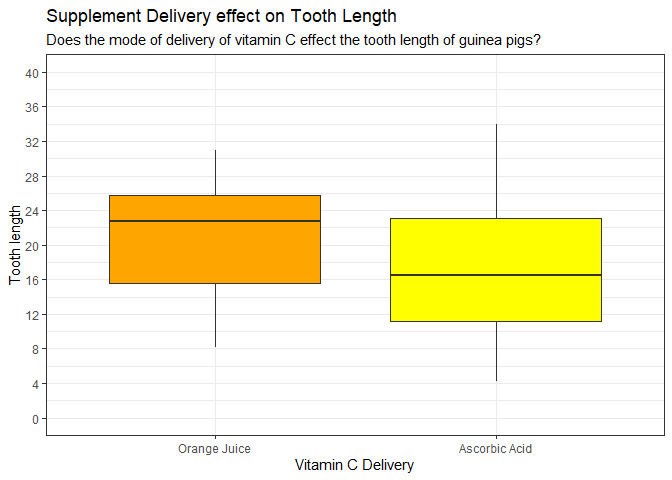
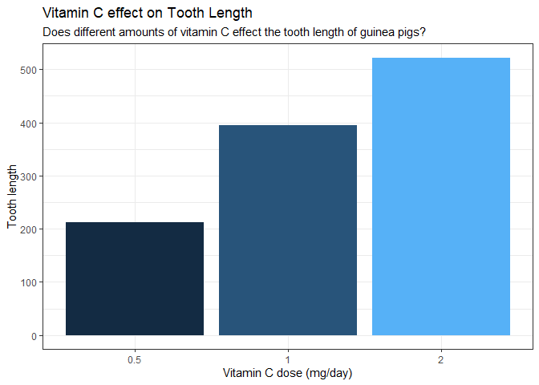
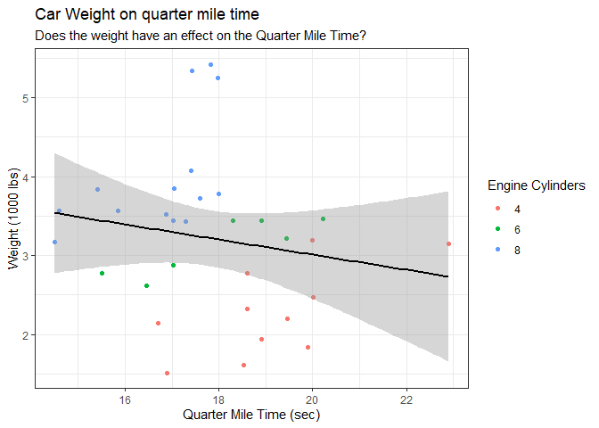
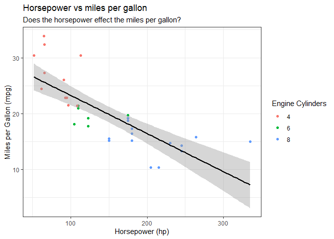

### Load packages

### Load data

```r
?ToothGrowth
```

```
## starting httpd help server ... done
```

```r
head(ToothGrowth)
```

```
##    len supp dose
## 1  4.2   VC  0.5
## 2 11.5   VC  0.5
## 3  7.3   VC  0.5
## 4  5.8   VC  0.5
## 5  6.4   VC  0.5
## 6 10.0   VC  0.5
```

```r
str(ToothGrowth)
```

```
## 'data.frame':	60 obs. of  3 variables:
##  $ len : num  4.2 11.5 7.3 5.8 6.4 10 11.2 11.2 5.2 7 ...
##  $ supp: Factor w/ 2 levels "OJ","VC": 2 2 2 2 2 2 2 2 2 2 ...
##  $ dose: num  0.5 0.5 0.5 0.5 0.5 0.5 0.5 0.5 0.5 0.5 ...
```


```r
ggplot(ToothGrowth, aes(supp, len)) +
  geom_boxplot(aes(fill = supp)) +
  scale_fill_manual(values = c('orange','yellow')) +
  scale_y_continuous(limits = c(0,40), breaks = seq(0,40,4)) +
  scale_x_discrete(labels = c('Orange Juice', 'Ascorbic Acid')) +
  labs(x = 'Vitamin C Delivery', y = 'Tooth length', title = 'Supplement Delivery effect on Tooth Length',
       subtitle = 'Does the mode of delivery of vitamin C effect the tooth length of guinea pigs?') +
  theme_bw() +
  theme(legend.position = 'none')
```

<!-- -->
This graph shows the result of the vitamin C delivery method had on the tooth length. I choose a box plot because it shows the range, the median, and the quartiles of the data. Ascorbic Acid has a bigger range of tooth length but Orange Juice has a higher median.


```r
ggplot(ToothGrowth, aes(factor(dose), len)) +
  geom_col(aes(fill = dose)) +
  scale_x_discrete(labels = c('0.5', '1','2' )) +
  labs(x = 'Vitamin C dose (mg/day)', y = 'Tooth length', title = 'Vitamin C effect on Tooth Length',
       subtitle = 'Does different amounts of vitamin C effect the tooth length of guinea pigs?') +
  theme_bw() +
  theme(legend.position = 'none')
```

<!-- -->


```r
?mtcars
head(mtcars)
```

```
##                    mpg cyl disp  hp drat    wt  qsec vs am gear carb
## Mazda RX4         21.0   6  160 110 3.90 2.620 16.46  0  1    4    4
## Mazda RX4 Wag     21.0   6  160 110 3.90 2.875 17.02  0  1    4    4
## Datsun 710        22.8   4  108  93 3.85 2.320 18.61  1  1    4    1
## Hornet 4 Drive    21.4   6  258 110 3.08 3.215 19.44  1  0    3    1
## Hornet Sportabout 18.7   8  360 175 3.15 3.440 17.02  0  0    3    2
## Valiant           18.1   6  225 105 2.76 3.460 20.22  1  0    3    1
```

```r
ggplot(mtcars, aes(x = qsec, y = wt)) +
  geom_point(aes(color = factor(cyl))) +
  geom_smooth(method = 'lm', color = 'black') +
  labs(x = 'Quarter Mile Time (sec)', y = 'Weight (1000 lbs)', title = 'Car Weight on quarter mile time',
       subtitle = 'Does the weight have an effect on the Quarter Mile Time?') +
  scale_color_discrete(name = 'Engine Cylinders') +
  theme_bw()
```

```
## `geom_smooth()` using formula 'y ~ x'
```

<!-- -->
I choose to do a linear regression to show the relationship between the weight and quarter mile time. It seems there may be a slight negative correlation but the confidence intervals are too wide to tell. I also grouped the data points by engine cylinders. The more cylinders in the engine means the more weight, but a higher quarter mile time.

```r
ggplot(mtcars, aes(x = hp, y = mpg)) +
  geom_point(aes(color = factor(cyl))) +
  geom_smooth(method = 'lm', color = 'black') +
  labs(x = 'Horsepower (hp)', y = 'Miles per Gallon (mpg)', title = 'Horsepower vs miles per gallon',
       subtitle = 'Does the horsepower effect the miles per gallon?') +
  scale_color_discrete(name = 'Engine Cylinders') +
  theme_bw()
```

```
## `geom_smooth()` using formula 'y ~ x'
```

<!-- -->
I choose to do a linear regression to show the relationship between the horsepower and the miles per gallon. There is a significant negative correlation. I also grouped the data points by engine cylinders. The more cylinders in the engine increases the horsepower, but decreases the miles per gallon.
