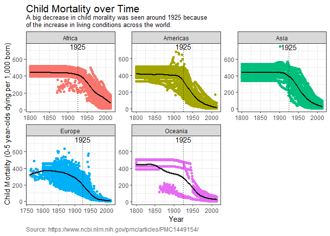

### Graphing child mortality over time

```r
financing_healthcare %>%
  filter(continent != "", child_mort != "") %>%
  ggplot(aes(year, child_mort, color = continent)) +
    geom_point() +
    geom_smooth(color = 'black') +
    geom_vline(xintercept = 1925, linetype = 'dotted') +
    annotate("text", x = 1925, y = 750, label = '1925') +
    facet_wrap(~continent, scales = 'free') +
  labs(x = 'Year', y = 'Child Mortality (0-5 year-olds dying per 1,000 born)', title = 'Child Mortality over Time',
       subtitle = 'A big decrease in child morality was seen around 1925 because\nof the increase in living conditions across the world.',
       caption = 'Source: https://www.ncbi.nlm.nih.gov/pmc/articles/PMC1449154/') +
    theme_bw() +
    theme(legend.position =  'none',
          plot.title = element_text(size = 16,margin = margin(t = 1)),
          plot.subtitle = element_text(size = 10), 
          plot.caption = element_text(hjust = 0, colour = 'gray40'))
```

```
## `geom_smooth()` using method = 'gam' and formula 'y ~ s(x, bs = "cs")'
```

<!-- -->
