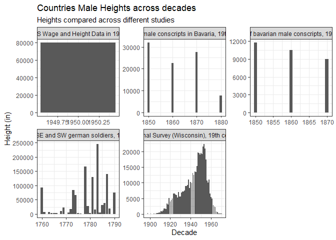

```r
germany <- worlddata %>%
  filter(`Continent, Region, Country` == 'Germany')

ggplot(worlddata, aes(x = year_decade, y = height.in)) +
  geom_boxplot() +
  geom_point(data = germany, color = 'red') +
  labs(x = 'Decade', y = 'Height (in)', title = 'Countries Heights across decades', subtitle = 'Heights compared to Germany (red)') +
  theme_bw()
```

<!-- -->


```r
tail(charty)
```

```
## # A tibble: 6 x 4
##   birth_year height.cm height.in study_id                                 
##        <dbl>     <dbl>     <dbl> <chr>                                    
## 1       1932     170.         67 National Survey (Wisconsin), 19th century
## 2       1925     173.         68 National Survey (Wisconsin), 19th century
## 3       1958     163.         64 National Survey (Wisconsin), 19th century
## 4       1958     163.         64 National Survey (Wisconsin), 19th century
## 5       1916     -66.0       -26 National Survey (Wisconsin), 19th century
## 6       1917     175.         69 National Survey (Wisconsin), 19th century
```

```r
ggplot(charty, aes(x = birth_year, y = height.in)) +
  geom_boxplot() +
  facet_wrap(~study_id, scales = 'free') +
  labs(x = 'Decade', y = 'Height (in)', title = 'Countries Male Heights across decades', subtitle = 'Heights compared across different studies') +
  theme_bw()
```

```
## Warning: Continuous x aesthetic -- did you forget aes(group=...)?
```

```
## Warning: Removed 12 rows containing missing values (stat_boxplot).
```

```
## Warning: Removed 9 rows containing non-finite values (stat_boxplot).
```

<!-- -->
The heights plot shows that Male Heights for Germans are increasing. It also shows that the median height for all the countries is slowly increasing. The height plot of the studies 
makes it hard to tell if the world height is increasing.

