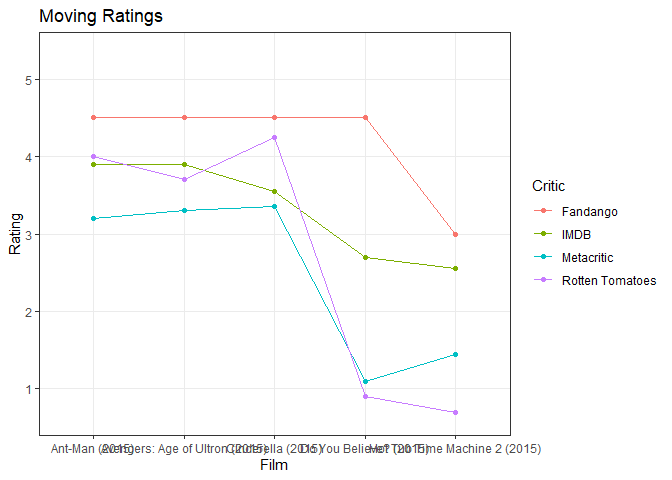

```r
ggplot(ratings, aes(x = FILM, y = rating, color = rater)) +
  geom_point() +
  geom_line(aes(group = rater)) +
  scale_y_discrete( 
                    limits = c("1","2","3","4","5"), breaks = c("1","2","3","4","5")) +
  scale_color_discrete(name = "Critic", labels = c("Fandango", "IMDB", "Metacritic","Rotten Tomatoes")) +
  labs(x = 'Film', y = 'Rating', title = 'Moving Ratings') +
  theme_bw()
```

<!-- -->
Fandango seems to give higher ratings. Fandango ratings also do not seem to change much. For half of the films, the ratings seem to be similar. However, for the other half the ratings are all over the place.
