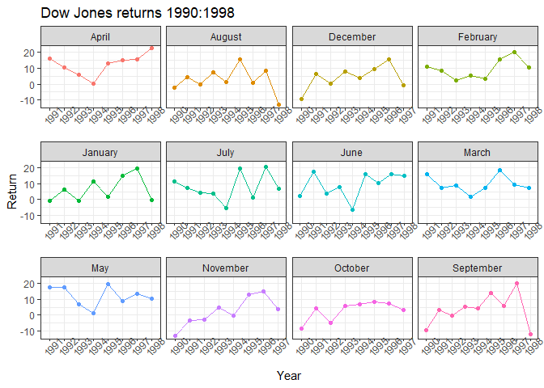

```r
ggplot(dart_expert_csv, aes(x = variable, y = value, fill = variable)) +
  geom_boxplot()
```

<!-- -->


```r
ggplot(dart_expert_csv, aes(x = variable, y = value)) +
  geom_jitter(aes(color = variable))
```

<!-- -->


```r
ggplot(dart_expert_csv, aes(x = contest_period, y = value, group = variable)) +
  geom_line(aes(color = variable))
```

<!-- -->


```r
DJIA_returns <- dart_expert_csv %>%
  filter(variable == 'DJIA') %>%
  mutate(contest_period = str_replace_all(contest_period, '19', '_19'),
         contest_period = str_replace(contest_period, 'Febuary', 'February'),
         contest_period = str_replace(contest_period, 'Dec._1993', 'December_1993')) %>%
  separate(contest_period, into = c("Month", "year_end"), sep = '-') %>%
  separate(year_end, into = c("Month", "year"), sep = '_') %>%
  pivot_wider(names_from = "year", values_from = "value") %>%
  arrange(factor(Month, levels = month.name)) %>%
  select(-variable)
view(DJIA_returns)
```


```r
DJIA_returns %>%
  pivot_longer(2:10, names_to = "year", values_to = "return", values_drop_na = TRUE) %>%
  ggplot(aes(x = year, y = return, group = Month)) +
    geom_point(aes(color = Month)) +
    geom_line(aes(color = Month)) +
    facet_wrap(~Month, scales = 'free_x') +
    labs(x = 'Year', y = 'Return' , title = 'Dow Jones returns 1990:1998') +
    theme_bw() +
    theme(legend.position = 'none', axis.text.x = element_text(angle = 45))
```

<!-- -->
The Boxplot shows that PROS has the highest return. However, the jitter plot shows the DJIA has the least variable returns and DARTS and PROS have similar variability. The geom_point confirms the jitter plot. The last plot shows the average return of the Dow from 1990 to 1998 and is grouped by month.


