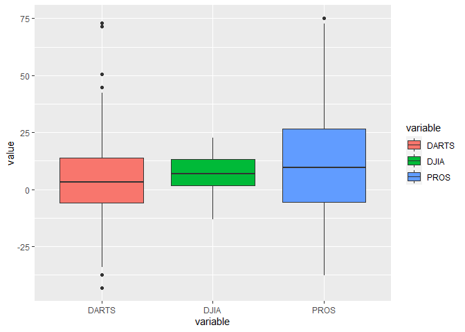
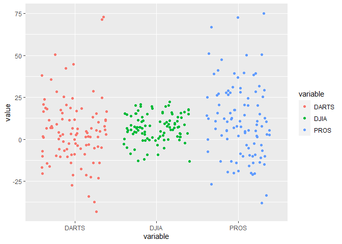
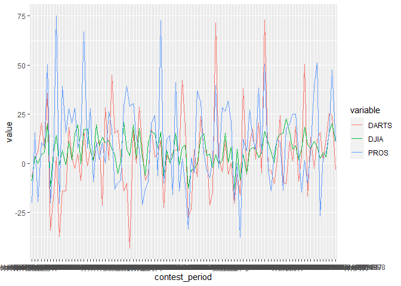

```r
head(dart_expert_csv)
```

```
## # A tibble: 6 x 3
##   contest_period      variable value
##   <chr>               <chr>    <dbl>
## 1 January-June1990    PROS      12.7
## 2 February-July1990   PROS      26.4
## 3 March-August1990    PROS       2.5
## 4 April-September1990 PROS     -20  
## 5 May-October1990     PROS     -37.8
## 6 June-November1990   PROS     -33.3
```

```r
ggplot(dart_expert_csv, aes(x = variable, y = value, fill = variable)) +
  geom_boxplot()
```

<!-- -->


```r
ggplot(dart_expert_csv, aes(x = contest_period, y = value)) +
  geom_jitter(aes(color = variable)) +
  facet_wrap(~variable)
```

<!-- -->


```r
ggplot(dart_expert_csv, aes(x = contest_period, y = value, group = variable)) +
  geom_line(aes(color = variable))
```

<!-- -->


```r
head(dart_expert_csv, n = 10)
```

```
## # A tibble: 10 x 3
##    contest_period             variable value
##    <chr>                      <chr>    <dbl>
##  1 January-June1990           PROS      12.7
##  2 February-July1990          PROS      26.4
##  3 March-August1990           PROS       2.5
##  4 April-September1990        PROS     -20  
##  5 May-October1990            PROS     -37.8
##  6 June-November1990          PROS     -33.3
##  7 July-December1990          PROS     -10.2
##  8 August1990-January1991     PROS     -20.3
##  9 September1990-February1991 PROS      38.9
## 10 October1990-March1991      PROS      20.2
```

```r
DJIA_returns <- dart_expert_csv %>%
  filter(variable == 'DJIA') %>%
  mutate(contest_period = str_replace_all(contest_period, '19', '_19'),
         contest_period = str_replace(contest_period, 'Febuary', 'February'),
         contest_period = str_replace(contest_period, 'Dec._1993', 'December_1993')) %>%
  separate(contest_period, into = c("Month", "year_end"), sep = c('-')) %>%
  separate(year_end, into = c("Month", "year"), sep = '_') %>%
  pivot_wider(names_from = "year", values_from = "value") %>%
  arrange(factor(Month, levels = month.name)) %>%
  select(-variable)
view(DJIA_returns)
```


