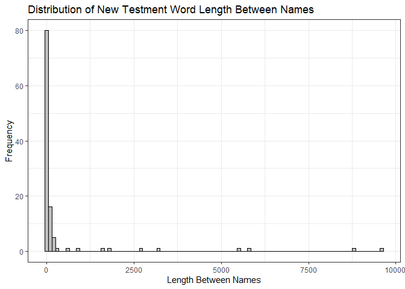
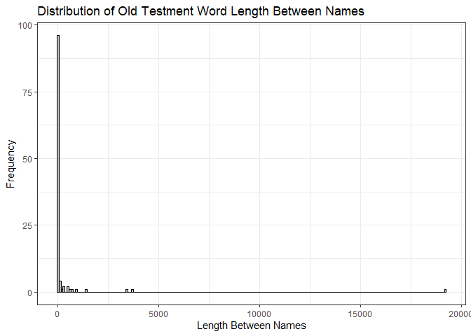

```r
#Function to find number of savior references
savior_references <- function(df) {
  count <- vector("integer", ncol(savior_names))
  for (name in savior_names) {
      count <- count + str_length(str_extract_all(df,name))
      names(count)
  }
  count
}
#Old Testament Savior References
sum(savior_references(old_testament_scripts))
```

```
## Warning in stri_length(string): argument is not an atomic vector; coercing
```

```
## [1] 33187
```

```r
#33,187
#New Testament Savior References
sum(savior_references(new_testament_scripts))
```

```
## Warning in stri_length(string): argument is not an atomic vector; coercing
```

```
## [1] 44280
```

```r
#44,280
```


```r
#Function to find words between instances
words_between <- function(df, test) {
  for (names in savior_names$name) {
    name_replace <- str_replace_all(df, names, '1234')
  }
  word_split <- str_split(name_replace, '1234')
  word_split_n <- str_remove_all(word_split, '\n')
  if (test == 'mean') {
    stri_stats_latex(unlist(word_split_n))[[4]]/ length(unlist(word_split))
  } else {
    stri_stats_latex(unlist(word_split_n))[[4]]
  }
}
```


```r
#Old testament words between instances
words_between(old_testament_scripts, 'between')
```

```
## Warning in stri_replace_all_regex(string, pattern,
## fix_replacement(replacement), : argument is not an atomic vector; coercing
```

```
## [1] 611503
```

```r
#611,503

#New testament words between instances
words_between(new_testament_scripts, 'between')
```

```
## Warning in stri_replace_all_regex(string, pattern,
## fix_replacement(replacement), : argument is not an atomic vector; coercing
```

```
## [1] 180662
```

```r
#180,662

#Average Old testament words between instances
words_between(old_testament_scripts, 'mean')
```

```
## Warning in stri_replace_all_regex(string, pattern,
## fix_replacement(replacement), : argument is not an atomic vector; coercing
```

```
## [1] 3135.913
```

```r
#3,135.913

#Average New testament words between instances
words_between(new_testament_scripts, 'mean')
```

```
## Warning in stri_replace_all_regex(string, pattern,
## fix_replacement(replacement), : argument is not an atomic vector; coercing
```

```
## [1] 12044.13
```

```r
#12,044.13
```


```r
as.data.frame(savior_references(new_testament_scripts)) %>%
  ggplot(aes(x = savior_references(new_testament_scripts))) +
    geom_histogram(color = 'black',fill = 'grey', binwidth = 100) +
    labs(x = 'Length Between Names', y = 'Frequency', title = 'Distribution of New Testment Word Length Between Names') +
    theme_bw()
```

```
## Warning in stri_length(string): argument is not an atomic vector; coercing

## Warning in stri_length(string): argument is not an atomic vector; coercing

## Warning in stri_length(string): argument is not an atomic vector; coercing
```

<!-- -->


```r
as.data.frame(savior_references(old_testament_scripts)) %>%
  ggplot(aes(x = savior_references(old_testament_scripts))) +
    geom_histogram(color = 'black',fill = 'grey', binwidth = 100) +
    labs(x = 'Length Between Names', y = 'Frequency', title = 'Distribution of Old Testment Word Length Between Names') +
    theme_bw()
```

```
## Warning in stri_length(string): argument is not an atomic vector; coercing

## Warning in stri_length(string): argument is not an atomic vector; coercing

## Warning in stri_length(string): argument is not an atomic vector; coercing
```

<!-- -->
  
  It looks like the New Testament has more references to the Savior name the Old Testament, 33,187 vs. 44,280. It also looks like the Old Testament has more words between the Savior names than the New Testament, 661,503 words with the average words between names being 3135.913. The New Testament has less words, 180,662 however it has a higher average between names of 12044.13.
  All three of these conclusion indicate the New Testament could be longer than the Old Testament. 


