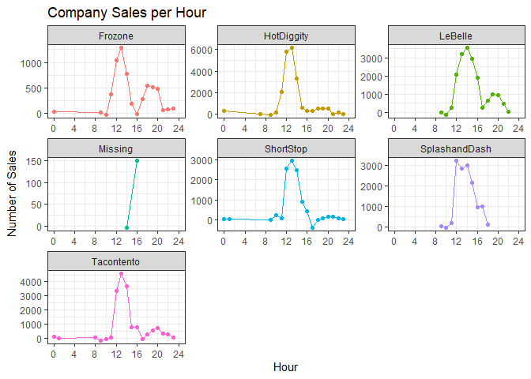
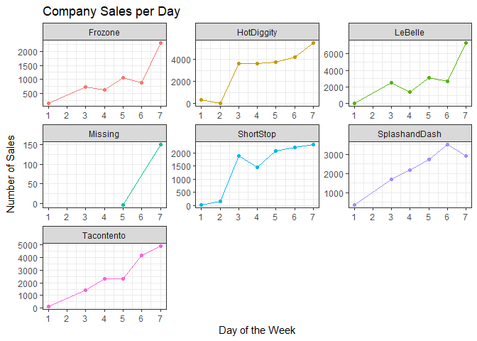
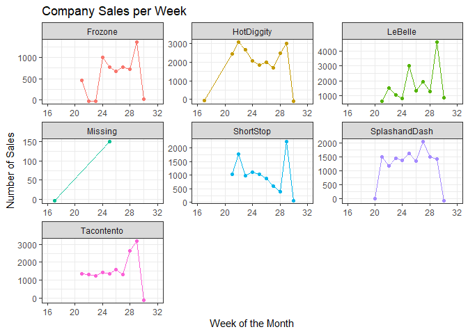
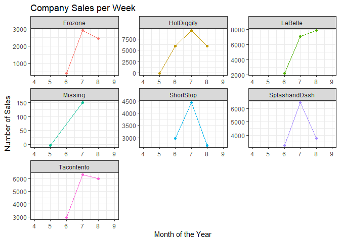
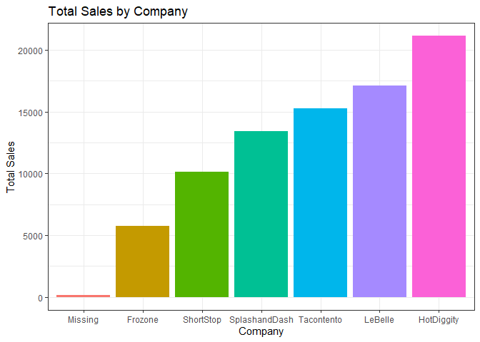

```r
#Create aggregate times (hourly,daily, weekly, monthly)
sales_data_times <- sales_data %>%
  with_tz(tzone = 'Us/Mountain') %>%
  mutate(hour = ceiling_date(Time, "hour"),
    day = ceiling_date(Time, "day"),
    week = ceiling_date(Time, "week"),
    month = ceiling_date(Time, "month"))
```


```r
#Create graph of sales per company per hour
sales_data_times %>%
  mutate(Hour = hour(hour)) %>%
  group_by(Name,Hour) %>%
  summarise(across(Amount, sum)) %>%
  ggplot(aes(x = Hour, y = Amount, color = Name)) +
    geom_point() +
    geom_line() +
    facet_wrap(~Name, scales = 'free') +
    labs(x = 'Hour', y = 'Number of Sales', title = 'Company Sales per Hour') +
    scale_x_continuous(limits = c(0, 24),breaks = seq(0, 24, 4)) +
    theme_bw() +
    theme(legend.position = 'none')
```

```
## `summarise()` has grouped output by 'Name'. You can override using the `.groups` argument.
```

<!-- -->
The recommendation for business hours should be from 9 a.m. to 9 p.m. This is because sales don't start picking up until slightly after 8, peak at 12 a.m, and decline until a slight spike at 8 p.m, then fall shortly after.


```r
#Create graph of sales per company per day of the week
sales_data_times %>%
  mutate(Day = wday(day)) %>%
  group_by(Name,Day) %>%
  summarise(across(Amount, sum)) %>%
  ggplot(aes(x = Day, y = Amount, color = Name)) +
    geom_point() +
    geom_line() +
    facet_wrap(~Name, scales = 'free') +
    labs(x = 'Day of the Week', y = 'Number of Sales', title = 'Company Sales per Day') +
    scale_x_continuous(limits = c(1, 7),breaks = seq(1, 7, 1)) +
    theme_bw() +
    theme(legend.position = 'none')
```

```
## `summarise()` has grouped output by 'Name'. You can override using the `.groups` argument.
```

<!-- -->
It seems throughout the week sales pick up, Sunday has the least amount of sales and Saturday has the most sales.


```r
#Create graph of sales per company per Week of the Month
sales_data_times %>%
  mutate(Week = week(week)) %>%
  group_by(Name,Week) %>%
  summarise(across(Amount, sum)) %>%
  ggplot(aes(x = Week, y = Amount, color = Name)) +
    geom_point() +
    geom_line() +
    facet_wrap(~Name, scales = 'free') +
    labs(x = 'Week of the Month', y = 'Number of Sales', title = 'Company Sales per Week') +
    scale_x_continuous(limits = c(16, 32),breaks = seq(16, 32, 4)) +
    theme_bw() +
    theme(legend.position = 'none')
```

```
## `summarise()` has grouped output by 'Name'. You can override using the `.groups` argument.
```

<!-- -->

The week with the best sales was 28. It is not surprising because Week 28 is from July 11, 2016 to July 17, 2016.

```r
#Create graph of sales per company per Month of the Year
sales_data_times %>%
  mutate(Month = month(month)) %>%
  group_by(Name,Month) %>%
  summarise(across(Amount, sum)) %>%
  ggplot(aes(x = Month, y = Amount, color = Name)) +
    geom_point() +
    geom_line() +
    facet_wrap(~Name, scales = 'free') +
    labs(x = 'Month of the Year', y = 'Number of Sales', title = 'Company Sales per Week') +
    scale_x_continuous(limits = c(4, 9),breaks = seq(4, 9, 1)) +
    theme_bw() +
    theme(legend.position = 'none')
```

```
## `summarise()` has grouped output by 'Name'. You can override using the `.groups` argument.
```

<!-- -->
Of the 3 month time period, July seemed to have the best overall sales. 

```r
#Total Sales per Company
total_sales <- sales_data_times %>%
  group_by(Name) %>%
  summarise(across(Amount, sum))

total_sales %>%
  mutate(Name = as.factor(fct_reorder(Name, Amount))) %>%
  arrange(desc(Amount)) %>%
  ggplot(aes(x = Name, y = Amount, fill = Name)) +
    geom_col() +
    labs(x = 'Company', y = 'Total Sales', title = 'Total Sales by Company') +
    theme_bw() +
    theme(legend.position = 'none')
```

<!-- -->
  Overall every company is doing well except Missing, which has next to 0 sales.Frozone is the next worse will slightly over 5000 sales units. However, the company will the most sales is HotDiggity. HotDiggity would be the best business to give a loan. Missing and Frozone are the worse businesses to give loans.
