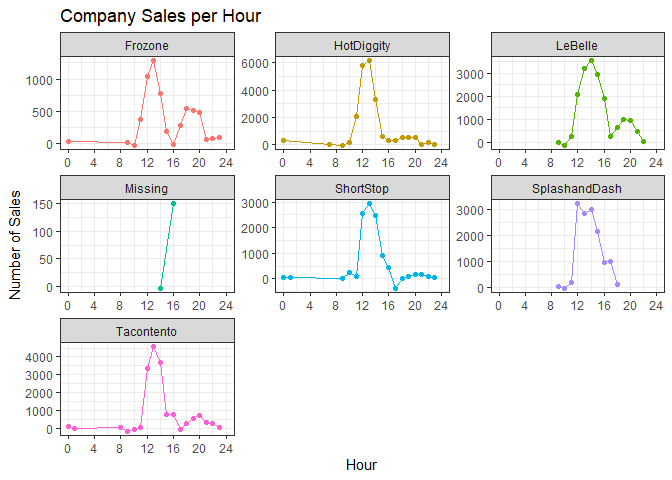

```r
#Create aggregate times (hourly,daily, weekly, monthly)
sales_data_times <- sales_data %>%
  with_tz(tzone = 'Us/Mountain') %>%
  mutate(hour = ceiling_date(Time, "hour"),
    daily = ceiling_date(Time, "day"),
    weekly = ceiling_date(Time, "week"),
    monthly = ceiling_date(Time, "month"),
    Hour = hour(hour)) %>%
  group_by(Name,Hour) %>%
  summarise(across(Amount, sum))
```

```
## `summarise()` has grouped output by 'Name'. You can override using the `.groups` argument.
```


```r
#Create graph of sales per company per hour
ggplot(sales_data_times, aes(x = Hour, y = Amount, color = Name)) +
  geom_point() +
  geom_line() +
  facet_wrap(~Name, scales = 'free') +
  labs(x = 'Hour', y = 'Number of Sales', title = 'Company Sales per Hour') +
  scale_x_continuous(limits = c(0, 24),breaks = seq(0, 24, 4)) +
  theme_bw() +
  theme(legend.position = 'none')
```

<!-- -->

