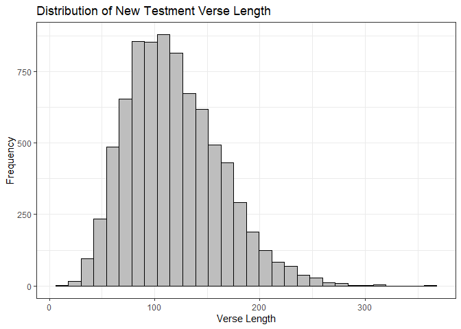

```r
#Function to find verse length
verse_length <- function(df) {
  v_length <- vector("integer",0)
  for (row in df) {
    v_length <- append(v_length,str_length(row))
  }
  v_length
}

#Old Testament average length
mean(verse_length(old_testament_scripts))
```

```
## [1] 136.7845
```

```r
#136.7845
#New Testament average length
mean(verse_length(new_testament_scripts))
```

```
## [1] 118.3265
```

```r
#118.3265
```


```r
#Old Testaments count of lord
str_length(str_extract_all(old_testament_scripts, "(?i)lord"))
```

```
## Warning in stri_extract_all_regex(string, pattern, simplify = simplify, :
## argument is not an atomic vector; coercing
```

```
## Warning in stri_length(string): argument is not an atomic vector; coercing
```

```
## [1] 58300
```

```r
#58,300

#New Testaments count of lord
str_length(str_extract_all(new_testament_scripts, "(?i)lord"))
```

```
## Warning in stri_extract_all_regex(string, pattern, simplify = simplify, :
## argument is not an atomic vector; coercing

## Warning in stri_extract_all_regex(string, pattern, simplify = simplify, :
## argument is not an atomic vector; coercing
```

```
## [1] 5900
```

```r
#5,900
```


```r
#Convert Verse Length vector to dataframe and Create Histogram
as.data.frame(verse_length(new_testament_scripts)) %>%
  ggplot(aes(x = verse_length(new_testament_scripts))) +
    geom_histogram(color = 'black',fill = 'grey') +
    labs(x = 'Verse Length', y = 'Frequency', title = 'Distribution of New Testment Verse Length') +
    theme_bw()
```

```
## `stat_bin()` using `bins = 30`. Pick better value with `binwidth`.
```

<!-- -->
  The average verse length of the Old Testament is 136.7845 and the average verse length if the Old Testament is 118.3265. The average verse length of the Old Testament is longer than the New Testament by almost 20 words. In the Old Testament the word 'lord' is mentioned 58,300 times compared to 5,900 times in the New Testament. Both these questions show that the Old Testament is longer and mentions the word 'lord' more than the New Testament.
  The distribution of the verse length of the New Testament is slightly right skewed. A large number of the frequency of the verse lengths is around 100 words. The graph also helps enforce the average verse length of 118.3265.
