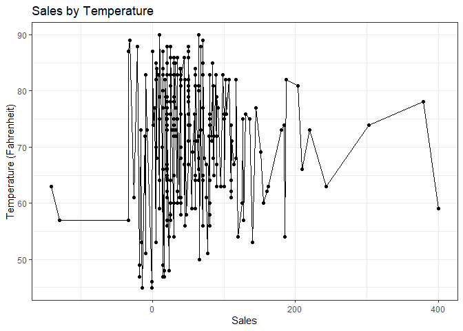

```r
#Change time to mountain time
car_wash_data_mst <- car_wash_data %>%
  with_tz(tzone = 'Us/Mountain')
```


```r
#Create hourly grouping variable
car_wash_hour <- car_wash_data_mst %>%
  mutate(hour = ceiling_date(time, "hour"))
```


```r
#Aggregate across hour sales
hour_sales <- car_wash_hour %>%
  group_by(hour) %>%
  summarise(across(amount, sum))
```


```r
weather <- riem_measures(station = "RXE",  date_start = '	
2016-05-13',  date_end  =  '2016-07-18 ') %>%
  with_tz(tzone = 'Us/Mountain') %>%
  filter(tmpf != "") %>%
  mutate(hour = ceiling_date(valid, "hour")) %>%
  select(hour, tmpf)
```


```r
#Combine Databases and graph sales by weather
merge(hour_sales,weather, by = "hour") %>%
  arrange(hour) %>%
  ggplot(aes(x = amount, y = tmpf)) +
    geom_point() +
    geom_line() +
    labs(x = 'Sales', y = 'Temperature (Fahrenheit)', title = 'Sales by Temperature') +
    theme_bw()
```

<!-- -->

